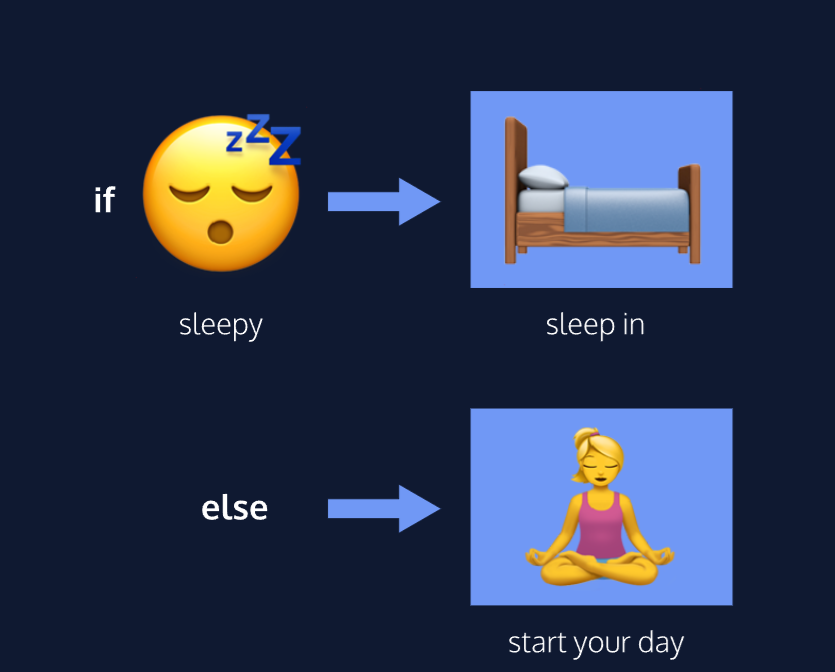

[link to the lesson on condtional statmens](https://www.codecademy.com/paths/build-web-apps-with-react/tracks/bwa-javascript-functions-arrays-and-loops/modules/learn-javascript-control-flow/lessons/control-flow/exercises/control-flow-intro)

This is the beeginning of the lessons on Conditinal Statements at Codecademy

